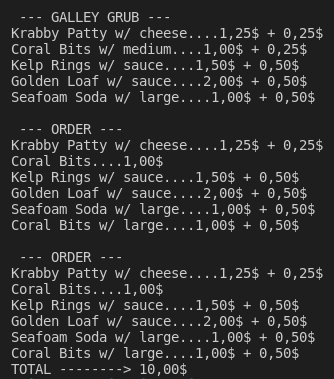

StockX ASCII
============

Bob Esponja trabaja como cocinero en el Krusty Krab, restaurante famoso por su hamburguesa de autor Krabby Patty.

El restaurante tiene un menu llamado Galley Grub que puedes leer aquí:

https://spongebob.fandom.com/wiki/Galley_Grub

Las comandas son anotadas a mano por Squidward Tentacles.

El propierario Eugene H. Krabs -un agarrao- en vez de adquirir un TPV ha decidido contratar a un estudiante de Dual para que construir un software que calcular el importe total del pedido e imprimir el recibo.
  
Intenta hacer como que programas si no quieres terminar en la cocina ayudando a Bob a preparar Krusty Burguers.

Implementa las historias de usuario con la lógica descrita en el `main` de la clase principal `App.java`. 

Si tienes dudas, puedes observar las historias de usuario _live_ en el capítulo _Pickles_ aquí:

https://www.youtube.com/watch?v=VlxSEEIwwNY&list=PL_181YA7nAlfR_0ro3l6Dh7ReB7AB7Mon

 ## Salida de la aplicación

Intenta que la salida del programa por CLI sea lo más parecida posible a las imágenes que se proporcionan. Cada una de ellas se corresponde con una de las historias de usuario que se detallan en los epígrafes siguientes.

## Diagrama de clases UML / Arquitectura de la app.

Sigue el diagrama de clase UML proporcionado para construir la aplicación.
Si añades algún componente, dibújalo a mano alzada sobre el diagrama.

## Historias de usuario /casos de uso

Las historias de usuario están enunciadas en el script principal `Stockx.java`

1. El usuario/a solicita la info del `sneaker` en todas las tallas (ultima `sale`, máxima `bid`, mínima `ask`, `name` y estilo o `style`)

2. El usuario/a lista todas las bids de una sneaker para conocer cuál es la `minima bid`.

3. El usuario/a lista todas las asks de una sneaker para conocer cuál es la `maxima ask`.

4. El usuario/a lista todas las `sales` de una sneaker para averiguar cuál es la última venta o `last sale`.

5. El usuario/a solicita la info del sneaker en todas las tallas (ultima venta, máxima bid, mínima ask, nombre y estilo) = Historia de usuario 1.

6. El usuario/a lista la info del sneaker en una determinada talla o `size`.

7. El usuario/a lista todas las sales de una sneaker en una determinada talla o `size` para averiguar cuál es la última venta.

8. El usuario/a lista todas las bids de una sneaker en una determinada `size` para conocer cuál es la mínima bid.

9. El usuario/a lista todas las asks de una sneaker en un determinada `size` para conocer cuál es la máxima ask.

## Prepara el proyecto

 1. Crea un nuevo repo PRIVADO en tu cuenta en **Github** y compártelo con el usuario dfleta.
 2. Crea un nuevo directorio en tu equipo y **clona el repositorio** de Github.
 3. Abre VSCode /Eclipse /Netbeans /IntelIJ y **establece como workspace** el directorio que has clonado.
 4. Crea un proyecto **Gradle** o **Maven**.
 5. Pon el proyecto en seguimiento en **Git** y configura `.gitignore`.
 6. Copia y pega la función principal `App.java`. Utilízala como guía en el proceso TDD. **No puedes modificar su código**, pero sí puedes comentar aquellas partes que aun no hayas implementado.
 7. Completa las clases que aquí se indican **implementando los casos test que necesites y que se propocionen**. Practica **TDD**.
 8. **Realiza `commits` como mínimo cada vez que termines una historia de usuario**. Sin commit periódicos, no corrijo el examen.

 ## Cómo entregar el código

 1. Crea un repo PRIVADO en tu GitHub y compártelo con el usuario dfleta.
 2. **Realiza commits periódicamente** mientras avanzas en el desarrollo de la aplicación. Sin commit periódicos, no corrijo el examen.
 3. Realiza un `push` al repo remoto en GitHub **SOLO cuando hayas terminado el proyecto**.
 3. Si quieres, si vas a dormir mejor, una vez publicado el repo en github, desde Eclipse /Netbeans /IntelIJ exporta el proyecto a un fichero. En VSCode, comprime en un ZIP la carpeta del proyecto. Envíame el archivo ZIP por correo electrónico. **No se admiten ficheros .rar**.
